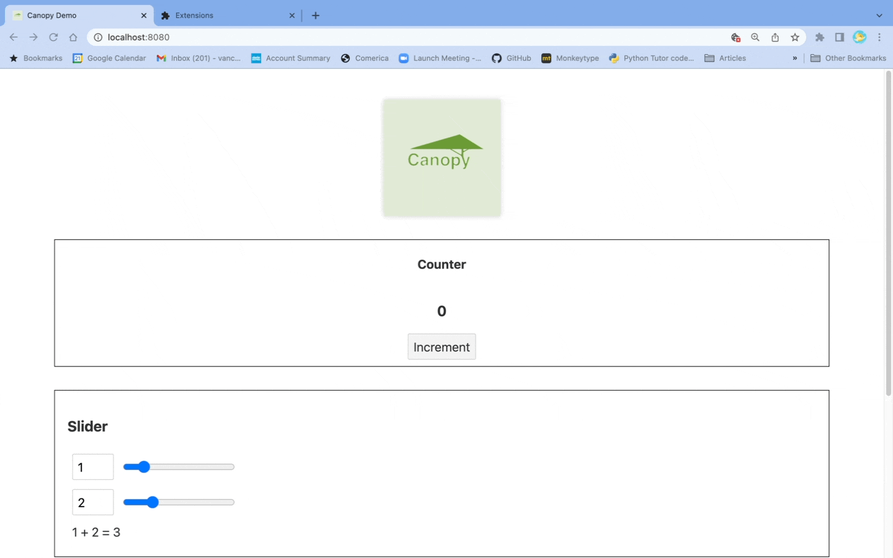
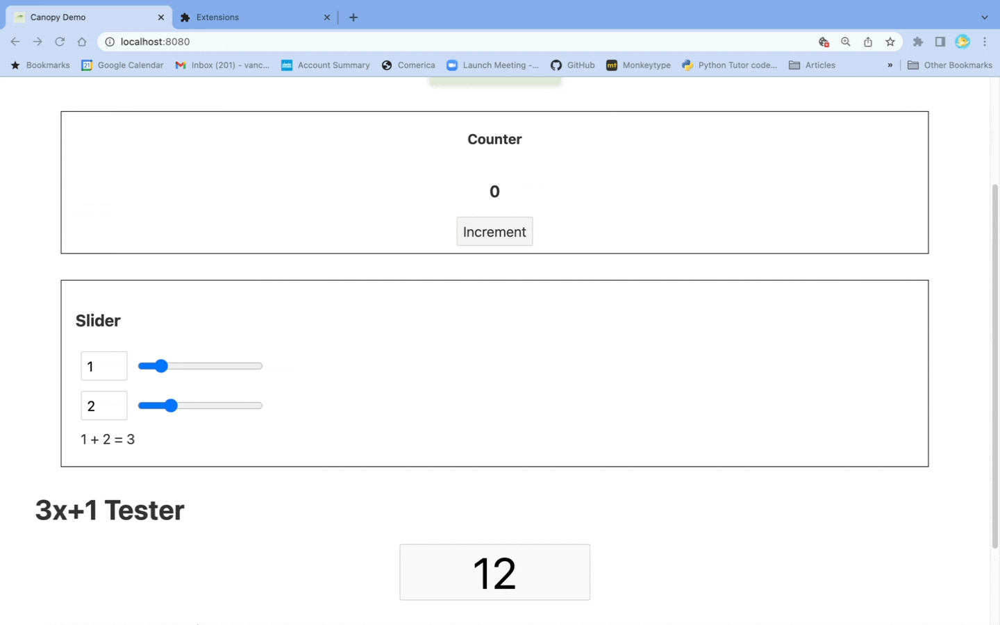

<!-- # Welome to Canopy! -->

*A svelte Svelte debugging app for svelte Svelte devs.*

Bonjour! Canopy is an extension of the Chrome devtools panel. To use it, you'll need to open a Svelte app in developer mode. (We've included one here too, in case you'd like to try Canopy straight out of the box &mdash; see the [Getting started](#getting-started) section below.)

Canopy offers the following two features.
* **A dynamically-updating component hierarchy tree.** This displays all instances of Svelte components that have been rendered, and automatically updates itself as components are created and destroyed.
* **A time-traveling state tracker.** This lists all state values, and takes a snapshot upon each state change that can be revisited with the click of a button.

1. [Getting started](#getting-started)
2. [State tracker](#state-tracker)
3. [Component tree](#component-tree)
4. [Debugging](#debugging)
5. [Contribute](#contribute)

## Getting started

As of now, Canopy has not yet been added to the Chrome Extension store. So to use it, please proceed as follows.

1. Clone this repo to your local machine.

2. Open a terminal, navigate to its root directory, and run the following command.
```
cd extension/src && npm i && npm run tsc && cd ../sidebar-bundle-generator && npm i && npm run build && cd ../panel-bundle-generator && npm i && npm run build && cd ../../
```

3. Open Google Chrome, navigate to [`chrome://extensions/`](chrome://extensions/), and make sure the "Developer mode" toggle in the top-right is switched on. Then, click the "Load unpacked" button in the top-left and select the directory `./extension/src/built` on your local machine.

4. Make sure that your Svelte app targets a DOM element with the id `root`. That is, your index/main `html` and `js` files should contain code that looks something like the following two snippets.

**index.html:**
```
<body>
    <div id="root"></div>
</body>
```
**index.js:**
```
import App from './App.svelte';

new App({
    target: document.getElementById("root"),
});
```

And voil&agrave;! You are now the proud owner of the latest instance of Canopy. To use, it simply run your favorite Svelte project *in dev mode* and open the appropriate `localhost` port in Chrome -- more specific instructions are below. Alternatively, you can use our pre-loaded Svelte project by navigating in your terminal to the directory `./demo-client` and running `npm run dev` .


## State tracker

Once you have opened your Svelte app in Chrome, go ahead and open the Chrome DevTools window (keyboard shortcut `F12`). Among the panels ("Elements", "Console", etc.), you should see "Canopy". And therein lies the state tracker. You should see a list of all state values that dynamically updates with all state changes, as depicted below.



Additionally, upon each state change Canopy takes a snapshot of all state values, and by clicking the corresponding button you can "time-travel" back to that state of your app. Each snapshot button is labeled by the state variable that was updated since the previous snapshot.

## Component tree

In order to see the component tree, head to the "Elements" panel, and then open the "Svelte Component Tree" sidebar. (Note that this might actually be *below* your DOM tree, depending on your configurations.) You should see a tree depicting the hierarchy of Svelte components that comprise your app, as depicted below.



This tree dynamically updates as components are created and destroyed, and you can hide/show the children of any node that has them (by clicking the adjacent -/+ button). Each node in the tree is labeled by its ID (which may be automatically assigned by Svelte) as well as the Svelte component of which it is an instance.


## Debugging

Canopy is still in beta, and unfortunately it is currently sensitive to the order in which certain operations are performed. If it is not working for you, please follow the following steps in order.

1. Be sure that all DevTools windows are closed.
2. Reload the extension (as described in the [Getting started](#getting-started) section above).
3. Refresh the page containing the Svelte app.
4. Canopy should now be available in the DevTools panel.


## Contribute

Canopy is an open-source product, developed under the auspices of the [Open Source Labs](https://github.com/open-source-labs) tech accelerator. The core Canopy team comprises [Aaron Mazel-Gee](https://github.com/aaron1729), [Jenna Moon](https://github.com/unbiya), [Justin Paige](https://github.com/jhpaige), and [Vance McGrady](https://github.com/VanceMcGrady). 

We welcome contributions of all kinds from the Svelte community: comments, questions, suggestions, bug reports, feature requests &mdash; and of course, additions to the codebase. Please feel free to contact us [here](mailto:canopy.for.svelte@gmail.com); we'd love to hear from you!